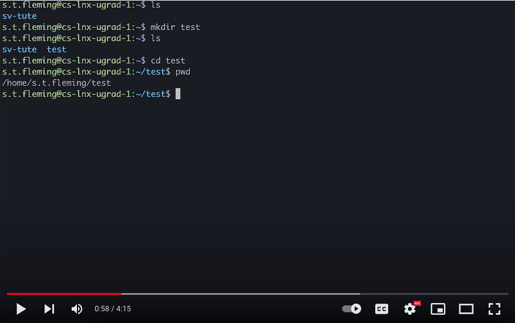
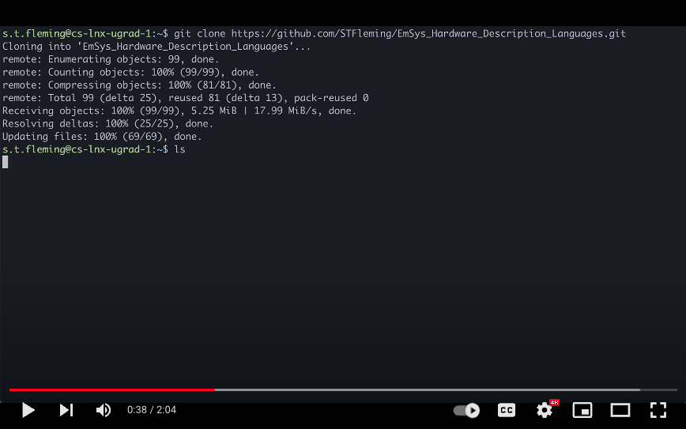
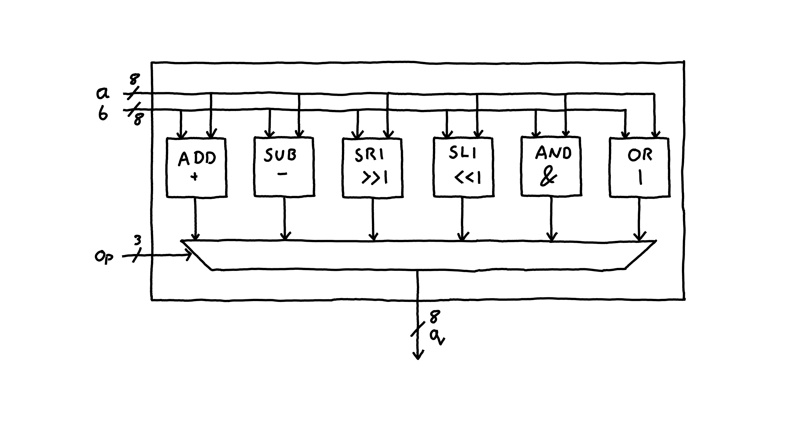
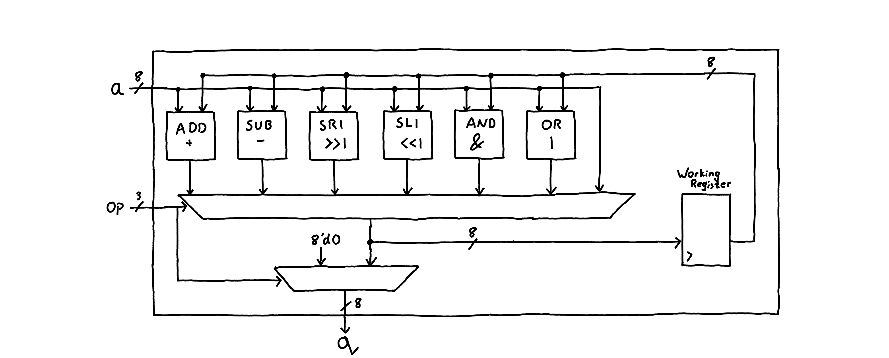

# Lab4: Describing combinatorial and sequential logic in Verilog 

In this lab, you will construct a basic ALU-like hardware module. You will write a small program for it in an assembly language, write the Verilog hardware description for the module, and simulate it with Verilator.

## Setting up your hardware development environment
For the lab work, you need to remote connect to the Linux lab machines in Uni, or you can physically come in and use the terminals in the lab session. If you remote connect and don't use the physical Linux machines in the labs, I fully encourage you to embrace the command line and to do all of your development via ssh. I understand that this might be daunting for some, it was for me when I first started, so I have made some videos a little further down this page to help.

### Connecting to a machine in the Linux lab
To connect to a lab machine you will need a few things:
1. A Linux lab account, COSIT should have emailed you with the details for this a week or two ago. Please let me know if you don't have one.
2. The ability to connect to the university VPN. 
3. An ssh client with X11 forwarding setup on your local machine.

__Connecting to the Uni VPN__

Please follow the guides [[here](http://vpn.swan.ac.uk/)]. _(I'm sorry, I know pulse secure is painful, I wish they had not closed the ssh ports last year)_

__Setting up ssh and X11 forwarding:__

To setup ssh and X11 forwarding I have found the following tutorials helpful in the past:
* [[For Windows](https://youtu.be/FlHVuA_98SA?t=151)]
* [[For Linux (Ubuntu)](https://youtu.be/FlHVuA_98SA)]
* [[For Mac](https://www.cyberciti.biz/faq/apple-osx-mountain-lion-mavericks-install-xquartz-server/)]

Once you have that setup on your machine, pick a linux machine machine from [[here](misc/machine_list.md)], and try and connect. 

### Basic bash and vim tutorial

I encourage you to try and work via ssh, using the bash terminal. In case you are not familiar with this, or need a quick refresher, then please watch the following short 5 min video that will demonstrate some basic usage.

<p align="center">
        <a href="http://www.youtube.com/watch?feature=player_embedded&v=ZfgbowDwgRU
        " target="_blank"></a>
</p>

### Testing out your lab environment

Once you've got ssh setup, connected to a machine, and familiarised yourself with bash and vim. Let's try simulating a hardware circuit. Please watch the following video:

<p align="center">
        <a href="http://www.youtube.com/watch?feature=player_embedded&v=r3rT3wBTRoU
        " target="_blank"></a>
</p>

## GitHub Repos 
You should all now have the lab setup code pushed to your GitHub repositories, check to make sure that you have:
```
        <your github repo>/lab4/task1
        <your github repo>/lab4/task2
```

In each of these subdirectories you should see:
* ```alu.sv``` The Verilog file where you will describe your ALU.
* ```program.emsys``` The assembler like code that you can use to program your ALU.
* Some files used to build and execute the Verilog simulation.

To build your hardware and simulate it in the relevant tasks directory type:
```
        make run
```

To run a set of tests on the hardware type:
```
        make test
```

For each of the tests, you should see the assembler line that was executed, what the expected value was, what the value your hardware produced was, and if the test passed or failed.


## Task 1 : Designing logic for a simple ALU-like module

In this first task, you will design a simple ALU-like module. ALU stands for arithmetic logic unit which are small blocks of hardware within a CPU that perform different arithmetic operations on some inputs depending on a programmable opcode.  

In each of these folders you can find the files used to describe the hardware, run the simulation, and program you hardware for both the tasks in this lab.


The following tutorial videos recapping what was covered in lecture 4 might be useful for this task:
* [1: simple in-n-out](https://www.youtube.com/watch?v=fnoMnokP9mI)
* [2: intermediate signals](https://www.youtube.com/watch?v=ljmm6S6k2Aw)
* [3: bus signals and multiplexers](https://www.youtube.com/watch?v=Jb-gnzetZts)
* [4(a): procedural blocks](https://www.youtube.com/watch?v=xdUcyrSBPWk)
* [4(b): literal values & concatenation](https://www.youtube.com/watch?v=3n8KvPvERuo)
* [4(c): larger multiplexer](https://www.youtube.com/watch?v=KYga2d_1dnA) 

The ALU module will have three inputs, __a__, __b__, and __op__. There is a single output, __q__. 
* __a__ is the first 8-bit operand.
* __b__ is the second 8-bit operand.
* __op__ is a 3-bit op-code that is used to select which arithmetic output is assigned to __q__.

How the op codes effect the assignments to __q__ is described in the following table. 

| OPCODE (binary) | ASSEMBLER COMMAND | DETAILS                                                                                           |
|-----------------|-------------------|---------------------------------------------------------------------------------------------------|
| 000             | ```ADD a b ```          | Performs addition on values __a__ and __b__ and assigns the value to __q__; __q__ = __a__ + __b__ |
| 001             | ```SUB a b ```          | Performs addition on values __a__ and __b__ and assigns the value to __q__; __q__ = __a__ - __b__ |
| 010             | ```SR1 a   ```          | Shifts the value __a__ one place to the right and assigns it to __q__;                            |
| 011             | ```SL1 a   ```          | Shifts the value __a__ one place to the left and assigns it to __q__;                             |
| 100             | ```AND a b ```          | Performs a bitwise AND operation on __a__ and __b__ and assigns it to __q__;                      |
| 101             | ```OR a b  ```          | Performs a bitwise OR operation on __a__ and __b__ and assigns it to __q__;                       |
| 110             |                   | Not used, __q__ should be 0                                                                       |
| 111             |                   | Not used, __q__ should be 0                                                                       |

To test your ALU, small assembler programs can be written in the file [[task1/program.emsys](task1/program.emsys)]. These commands will be converted into op-codes and fed into your hardware circuit during the simulation. An example of this could be: 

```
ADD 1 2
SUB 100 50
SL1 3
```

After each of these commands executes in our ALU hardware module we should see the following on the __q__ output, 3 after ```ADD 1 2```, 50 after ```SUB 100 50```, and 6 after ```SL1 3```.

### The hardware

A stub for the hardware module that you must complete can be found here [[task1/alu.sv](task1/alu.sv)]. In it you will find:

```v
module alu (
	input logic [7:0] a,
	input logic [7:0] b,
	input logic [7:0] op,

	output logic [7:0] q
);

endmodule
```

You need to complete the design for this module. The assembly program written in [[task1/program.emsys](task1/program.emsys)] will appear at the inputs of the module during simulation. As a first step I recomend compiling a simple program and observing how the __op__, __a__, and __b__ inputs are changing as you would expect. 

To simulate the hardware and inspect the waveforms for task1 do the following: 
1. Navigate into the task1 directory ``` cd task1```
2. Type ```make``` to build the simulation and run it. 
3. Once the simulation finishes, type ``gtkwave wavedump.vcd`` to view the waveform.

__Complete the Verilog hardware description in [[task1/alu.sv](task1/alu.sv)] to take the inputs and assign the appropriate value to the output ```q```. You do not need to write anything in the README.md files, the hardware description is sufficient.__

A possible design for your circuit could be as follows:



### Some useful tips & getting started

* Verilog has operators for addition + and subtraction -. You __do not__ need to implement adder logic from first principles using logic gates. 
* First I would recommend simulating the hardware without any logic inside and make sure you understand how the input signals, __a__, __b__, and __op__ are changing in relation to the input program ```program.emsys```. 

## Task 2 : Adding a working register 

We are now going to upgrade our ALU from task 1 to contain a working register. This is a single register that can store some data that we can operate over. 
To do this we will need to add some simple sequential logic circuitry so that we can save some state, the following videos recapping what was taught in Lecture 5 might be helpful for this.
* [1: sequential logic and D-Type flip flops](https://www.youtube.com/watch?v=jlS4MDr58C8)
* [2: describing a counter circuit](https://www.youtube.com/watch?v=U3K91t8aIXA)
* [3: write enable register](https://www.youtube.com/watch?v=rLxE8sf2zPM)



Instead of three inputs, the ALU now has only two.
* An opcode input __op__.
* A data input, __a__.

In the diagram above you'll notice that the output of the multiplexer is now fed into an internal working register in the ALU. This register stores the value of the current operation. The output of the register is fed into the input of the different operations (e.g. ADD, SR1) allowing us to operate on output of the previous operation. 

For this version of the ALU we require different OPCODES. Below is a table of the OPCODE and their expected function, where ``w`` is the value inside the working register. 

| OPCODE (binary) | ASSEMBLER COMMAND | DETAILS                                                                                           |
|-----------------|-------------------|---------------------------------------------------------------------------------------------------|
| 000             | ``ADD a``  | Store the value __w__ + __a__ in the working register; Output __w__ + __a__ at __q__ |
| 001             | ``SUB a``  | Store the value __w__ - __a__ in the working register; Output __w__ - __a__ at __q__ |
| 010             | ``SR1``  | Save the value __w__ >> 1 in the working register; Output __w__ >> 1 at __q__ |
| 011             | ``SL1``  | Save the value __w__ << 1 in the working register; Output __w__ << 1 at __q__ |
| 100             | ``AND a``  | Save the value __w__ & __a__ in the working register; Output __w__ & __a__ at __q__ |
| 101             | ``OR a``  | Save the value __w__ | __a__ in the working register; Output __w__ | __a__ at __q__ |
| 110             | ``SET a``    | Stores the value __a__ in the working register; Output 0 at __q__ |
| 111             |     | working register remains unchanged; output 0 at q |


__Complete the Verilog hardware description in [[task2/alu.sv](task2/alu.sv)] such that the opcodes execute correctly for some input functions__ 

